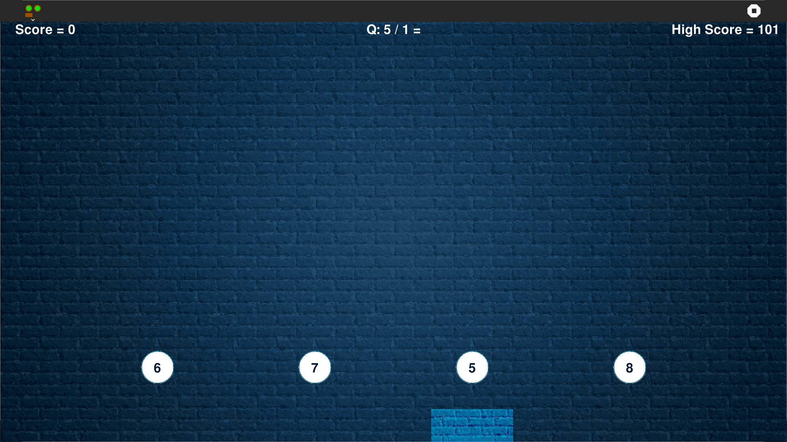
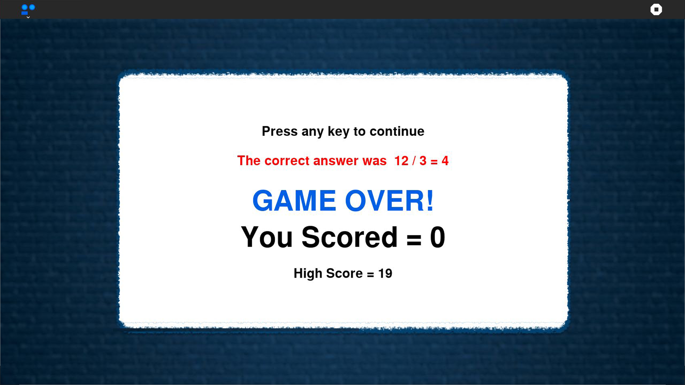

## NumberRush Activity ##

A game of simple math to improve calculation speed of the player.

Can be run independently as a **.py** application or can be run on **Sugar**.

The game requires the player to solve a simple mathematical question, by collecting the ball with the correct answer on it.

Four balls each with a different number drop from the top of the display and a mathematical problem will be shown on the top *(Example : 10 - 6)*. The player scores by collecting the ball with the right answer on it *(here : 4)*, in the box.

The player is awarded a point for each correct answer and the game ends when a wrong ball is collected.

The balls drop faster as the game continues to make the higher points more challenging.

How to use?
-----------

NumberRush is not part of the Sugar desktop, but can be added. Please refer to;

* [How to Get Sugar on sugarlabs.org](https://sugarlabs.org/),
* [How to use Sugar](https://help.sugarlabs.org/).

Contributing
------------

Please consider [contributing](https://github.com/sugarlabs/sugar-docs/blob/master/src/contributing.md) to the project with your ideas and your code.
